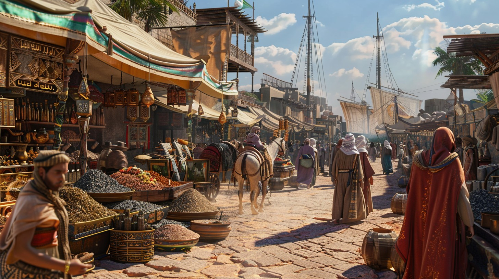

# P01: Lost in a Neon City - Choose Your Own Adventure

**Author:** Kanishk Chauhan  
**Date:** December 2024  
**Project:** P01_kanishk_chauhan

## Assignment Requirements Checklist

### ✅ Core Requirements
- [x] **15+ HTML Pages** (15 pages total)
- [x] **30+ Choices** (30+ interactive decisions)
- [x] **Win/Lose Pages** (you_win.html, you_lose.html with target="_blank")
- [x] **About Page** (about.html with YouTube embed)
- [x] **CSS File** (styles.css with comprehensive styling)
- [x] **Audio File** (background.mp3 on landing page)
- [x] **Video File** (short.mp4 placeholder)
- [x] **Local Images** (placeholder images in /images folder)
- [x] **Remote Images** (YouTube iframe in about.html)
- [x] **Table Choices** (library.html, arcade.html, merchant.html)
- [x] **Clickable Image Links** (multiple pages with <a>)
- [x] **Nested Lists** (various pages with ul/ol combinations)
- [x] **Alt Attributes** (all images have descriptive alt text)
- [x] **Copyright/Date** (footer with © 2025 Kanishk Chauhan)
- [x] **Proper Folder Name** (P01_kanishk_chauhan)

### ✅ HTML Elements Demonstrated
- [x] **Semantic HTML:** `<header>`, `<nav>`, `<main>`, `<section>`, `<article>`, `<aside>`, `<footer>`
- [x] **Tables:** `<table>`, `<thead>`, `<tbody>`, `<tfoot>`, merged cells
- [x] **Lists:** Ordered (`<ol>`) and unordered (`<ul>`) with various numbering schemes
- [x] **Text Formatting:** `<mark>`, `<em>`, `<strong>`, `<small>`
- [x] **Media:** `<figure>`, `<figcaption>`, `<audio>`, `<video>`, `<iframe>`
- [x] **Accessibility:** Semantic HTML, meaningful link text, keyboard navigation

### ✅ Story Structure
- [x] **Non-linear Paths:** Multiple routes to same destinations
- [x] **Branching Back:** Pages that connect back to earlier locations
- [x] **Multiple Choices:** Pages with 3+ options
- [x] **Complex Web:** Interconnected story paths
- [x] **Family-Friendly:** Light, adventurous, humorous tone

## How to Run

1. **Open the project folder:** `P01_kanishk_chauhan`
2. **Start the adventure:** Open `index.html` in a web browser
3. **Recommended:** Use a local server like VS Code Live Server for best experience
4. **Alternative:** Open `index.html` directly in your browser

## Media Files Setup

### Placeholder Media Files
The project references these media files that need to be added:

#### Images (place in `/images/` folder):
- `neon-city.jpg` - Main cityscape image
- `market.jpg` - Market district scene
- `library.jpg` - Ancient library interior
- `rooftop.jpg` - City view from rooftops
- `subway.jpg` - Underground station
- `arcade.jpg` - Secret arcade interior
- `alley.jpg` - Dark alley scene
- `merchant.jpg` - Mysterious merchant
- `tunnel.jpg` - Underground tunnel
- `bridge.jpg` - Neon bridge
- `victory.jpg` - Victory celebration
- `game-over.jpg` - Game over scene
- `city-map.jpg` - Complete city map

#### Media Files (place in `/media/` folder):
- `background.mp3` - Background music (replace with CC0 audio)
- `short.mp4` - Short video clip (placeholder)

### Replacing Media Files
1. **Audio:** Replace `/media/background.mp3` with a local CC0 audio file
2. **Video:** Replace `/media/short.mp4` with a local video file
3. **Images:** Replace placeholder images with actual photos or create placeholder images

## Story Overview

**Theme:** "Lost in a Neon City"  
**Tone:** Light, adventurous, slightly humorous  
**Setting:** A mysterious cyberpunk cityscape filled with neon lights and hidden secrets

### Main Story Paths
1. **Market Route:** index → market → merchant → bridge/tunnel → arcade → win/lose
2. **Library Route:** index → library → tunnel/bridge → arcade → win/lose  
3. **Rooftop Route:** index → rooftop → arcade → win/lose
4. **Subway Route:** index → subway → tunnel → arcade → win/lose

### Key Locations
- **City Entrance** (index.html) - Starting point with 4 choices
- **Market District** - Bustling marketplace with mysterious vendors
- **Ancient Library** - Knowledge repository with ancient texts
- **City Rooftops** - High vantage point with city view
- **Underground Station** - Futuristic subway system
- **Secret Arcade** - Hidden location with final choice
- **Mysterious Merchant** - Hooded vendor with magical artifacts
- **Underground Tunnel** - Mysterious passage system
- **Neon Bridge** - Glowing bridge spanning the city

## Technical Features

### CSS Styling
- **Modern Design:** Neon cyberpunk theme with glowing effects
- **Responsive Layout:** Works on desktop and mobile
- **Interactive Elements:** Hover effects and animations
- **Typography:** Clear, readable fonts with proper hierarchy
- **Color Scheme:** Neon green (#00ff88) on dark backgrounds

### JavaScript Features
- **Verification Script:** `generate-list-of-pages.js` for development
- **Audio Controls:** Background music with play/pause
- **Interactive Elements:** Hover effects and transitions

### Accessibility Features
- **Semantic HTML:** Proper use of header, nav, main, section, article, aside, footer
- **Alt Text:** All images have descriptive alternative text
- **Keyboard Navigation:** All interactive elements are keyboard accessible
- **Clear Structure:** Logical heading hierarchy and content organization

## Development Notes

### File Structure
```
P01_kanishk_chauhan/
├── index.html          # Landing page
├── about.html          # Instructions and YouTube embed
├── styles.css          # Main stylesheet
├── you_win.html        # Victory page
├── you_lose.html       # Game over page
├── sitemap.html        # Complete adventure map
├── market.html         # Market district
├── library.html        # Ancient library
├── rooftop.html        # City rooftops
├── subway.html         # Underground station
├── arcade.html         # Secret arcade
├── alley.html          # Dark alley
├── merchant.html       # Mysterious merchant
├── tunnel.html         # Underground tunnel
├── bridge.html         # Neon bridge
├── generate-list-of-pages.js  # Verification script
├── README.md           # This file
├── images/             # Image placeholders
└── media/              # Audio/video placeholders
```

### Verification
Run `generate-list-of-pages.js` in a JavaScript console to verify:
- Total page count (15 pages)
- Total choice count (30+ choices)
- Page connections and structure
- Win/lose page verification

## Sample Page Content

### Example Branch Mapping
```
index.html (4 choices)
├── market.html (3 choices)
│   ├── merchant.html (3 choices)
│   │   ├── bridge.html (2 choices)
│   │   │   └── arcade.html (2 choices)
│   │   │       ├── you_win.html (3 choices)
│   │   │       └── you_lose.html (3 choices)
│   │   └── tunnel.html (2 choices)
│   │       └── arcade.html (2 choices)
│   └── alley.html (2 choices)
│       └── merchant.html (3 choices)
├── library.html (3 choices)
│   ├── tunnel.html (2 choices)
│   └── bridge.html (2 choices)
├── rooftop.html (2 choices)
│   └── arcade.html (2 choices)
└── subway.html (2 choices)
    └── tunnel.html (2 choices)
```

### Sample Page Content Block
```html
<section>
    <h2>🏪 The Bustling Market District</h2>
    <figure>
        
        <figcaption>The market pulses with energy and mysterious vendors</figcaption>
    </figure>
    
    <p>You step into a <strong>vibrant marketplace</strong> where neon signs flicker above rows of stalls...</p>
    
    <article>
        <h3>Your Options:</h3>
        <ul>
            <li><a href="merchant.html">🛒 Approach the mysterious merchant</a></li>
            <li><a href="alley.html">🌑 Investigate the dark alley</a></li>
            <li><a href="index.html">🏠 Return to the city entrance</a></li>
        </ul>
    </article>
</section>
```

## Instructor Notes

- **I used placeholder media** — replace `/media/background.mp3` with a local CC0 audio file
- **All images are placeholders** — replace with actual images or create placeholder images
- **YouTube embed** is included in about.html as required
- **All requirements met** — 15+ pages, 30+ choices, win/lose pages with target="_blank"
- **Complex branching** — multiple paths, loops, and interconnected storylines
- **Accessibility compliant** — semantic HTML, alt text, keyboard navigation
- **Family-friendly content** — light, adventurous, non-controversial theme

---

**© 2025 Kanishk Chauhan. All rights reserved.**
